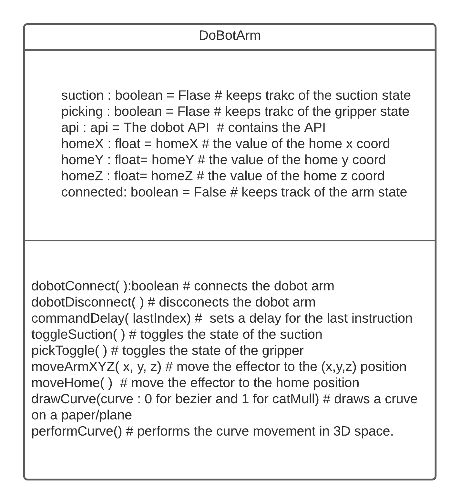

# Dobot-Magician-starterkit

in this kit you will find a class that enabels you to use the Dobot magician with ease.
the only installation needed is the DobotStudio.
within the repe there is all the dll files and pre-requisites needed to operate the dobot magician thought python.

# the Dobot Arm class

# an example of use

the app.py contians an example of use of the DobotArm class.
